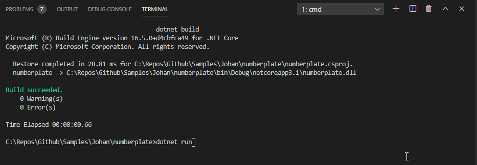

# South-Africa-Number Plates
Dynamically provides the combinations number valid number plates in South-Africa

Based on Wiki Entry:

https://en.wikipedia.org/wiki/Vehicle_registration_plates_of_South_Africa

```
Keys:
UPPER CASE LETTERS: Literal letters in the number plate
a: compulsory letter (A - Z)
b: letter (A - Z) or nothing
x: compulsory character (A - Z, 0 - 9)
z: character (A - Z, 0 - 9) or nothing
#: an integer number (1 - 999,999)
+: a compulsory digit (0 - 9)

NB:Vowels are not used on private vehicles.
```
Sample 1:


Sample 2:


Sample 3:


Sample 4:

